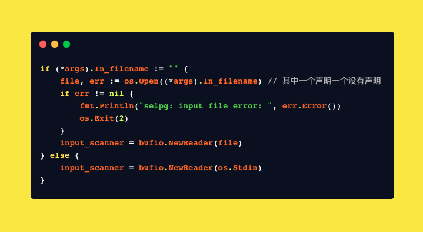
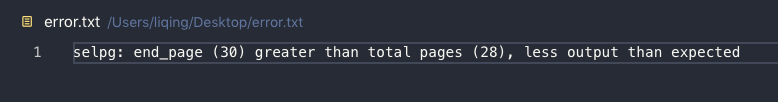
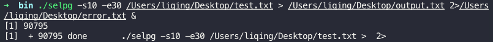

# selpgGO
* selpg 是selected page的缩写。该程序是以go语言实现的Linux命令行实用程序。简单来说可以将该程序的标准输入流/指定输入文件中文本找出特定页数范围的内容。


### 目录

* [Build](#Build)
* [Usage](#Usage)
* [Implementation](#Implementation)
* [Test](#Test)

### Build
该程序用到了第三方go包：`spf13/pflag`
需要先安装该依赖包：

`go get github.com/spf13/pflag`

接下来在获取本包：

`go get github.com/Eayne/selpgGO`

切换到`$GOPATH/src/github.com/Eayne/selpgGO/selpg`后，用命令`go install`即可自动安装好二进制可执行文件

可以通过切换到`$GOPATH/bin`中执行`./selpg`文件，也可以通过改写`$PATH`增加该文件夹地址后，直接执行`selpg`命令

### Usage

该程序的使用命令参数：
`selpg -s start_page -e end_page [ -f | -l lines_per_page ] [ -ddest ] [ in_filename ]`
* -s start_page是必须的参数，要求输入开始选取的页面数
* -e end_page是必须的参数，要求输入结束选取的页面数。
* -f 是可选参数。该参数说明输入文件的分页类型是通过`/f`来分隔的
* -l lines_per_page是可选参数。该参数说明输入文件的分页类型是通过每页固定行数(lines_per_page)来分隔的。
* 如果-f和-l参数都不选，则默认使用-l 72。另外-f和-l参数中至多只能出现一个。
* -d dest 该参数是可选的。可以指定输出文件到指定的打印机设备(dest)。该参数不会检查，要求用户输入正确的打印机设备地址。selpg会通过命令`lp`来将程序输出导出到设备的输入中去。如果没有指定dest的话，则默认输出到标准输出当中。
* in_filename是可选参数，可以指定要求的输入文件。如果没有输入文件，则默认输入来自于标准输入，用户可以通过在标准输入的末尾加上EOF符号表明输入结束，交给selpg处理。

如果参数输入有误会报错并异常退出程序。(如输入不存在的参数，或者格式错误或逻辑错误等)

selpg指定参数的方式可以是`-flag XX`或者`-flagXX`或者`-flag=XX`。其中flag是参数缩写，XX是参数指定内容。

selpg的标准输入流方式可以改变。可以通过管道(`|`)或者标准输入重定位(`<`)来改变输入selpg文本的方式。

selpg的标准输出流方式也可以改变，类似的通过管道(`|`)或者标准输出重定位(`>`)来改变selpg输出指定页数文本的方式。

以下是一些可以的使用方式：

> $ selpg -s1 -e1 input_file
>
> $ selpg -s1 -e1 < input_file 
>
> $ other_command | selpg -s10 -e20
>
> $ selpg -s10 -e20 input_file >output_file 
>
> $ selpg -s10 -e20 input_file 2>error_file 
>
> $ selpg -s10 -e20 input_file >output_file 2>error_file 
>
> $ selpg -s10 -e20 input_file >output_file 2>/dev/null 
>
> $ selpg -s10 -e20 input_file >/dev/null 
>
> $ selpg -s10 -e20 input_file | other_command 
>
> $ selpg -s10 -e20 input_file 2>error_file | other_command 
>
> $ selpg -s10 -e20 -l66 input_file 
>
> $ selpg -s10 -e20 -f input_file 
>
> $ selpg -s10 -e20 -dlp1 input_file 
>
> $ selpg -s10 -e20 input_file > output_file 2>error_file & 

上面的使用方式也将会用在后面的[测试部分](#Test)

### Implementation

实现部分主要分为三个包来构建：
```
  |-selpg //该包是Main包，主要是调用后面的arg包和read包
  |---selpg.go 
  |-arg //该包主要处理输入命令行的参数
  |---arg.go
  |-read //该包主要处理读取指定页面的功能
  |---read.go
```
#### selpg


该包主要是`main`函数的入口。负责调用`arg`来处理命令行参数(`Bind`，`Parse`和`Process_args`)以及调用`read`来处理分页(`Process_input`)

#### arg

对于命令行参数，在该包中定义了一个结构体`Selpg_args`来方便传递参数。


可以看到其中的参数正是在[Usage](#Usage)中定义的输入的参数部分。

对于命令行参数的处理，该包分为三个函数：
* `Bind`: 由于`arg`包是利用`pflag`第三方包来处理输入参数的，因此该函数主要是调用`pflag`中的初始化部分，使得输入的参数可以绑定到结构体对应的变量中。
  

  可以看到对于不同的类型都有不同的对应函数。其中参数分别是：变量指针，参数全称，参数缩写，初始值，提示语句。

* `Parse`: 该函数调用`pflag`的`Parse`函数，使得结构体中定义好的变量被赋值。由于输入文件的名字是通过`pflag`的`non-flag`参数，因此该函数也会检测`non-flag`参数的数量，如果多于1个说明参数输入格式错误，会异常退出程序。
  

* `Process_args`:该函数主要是用来处理输入参数的逻辑错误。一旦发现错误就异常退出。其中包括：

    1. start page参数错误。如为负数或者超过int的最大值
    2. end page参数错误。如为负数或者超过int的最大值或者比start page参数小
    3. 没有输入必须的参数start page或者end page
    4. 同时输入`-f`和`-l`参数
    5. 输入了`-l`参数，但是页面长度格式错误(如为负数或者超过int的最大值)
    6. 其余的参数格式错误等可以交给`pflag`来处理。如`non-flag`参数，或者输入没有指定的参数等。
    
#### read

​	`read`包是主要处理分页功能。该包的主要实现逻辑如下：

* 根据是否有输入文件参数，决定输入流的`io.Reader`是`os.Stdin`还是`file`

  这里我设计的输入流`Reader`是利用`bufio`中的`NewReader`。如果是标准输入，就传入`os.Stdin`，如果是文件，那就先打开文件(`os.Open`)后返回文件指针`*File`，在传递给该函数。

  `bufio.Reader`是带缓冲区的`Reader`。大部分的文件读写都是通过实现接口`Reader`和`Writer`形成不同的类型。

  

* 根据是否有目的地参数，决定输出流的`io.Writer`为`PipeWriter`还是`bufio.Writer(os.Stdout)`

  这里我的`Writer`类型是`io.Writer`而不是`bufio.Writer`，原因在于前者是接口类型，对于上面的两种类型都可以通过多态来赋值。

  如果没有目的地，就用带有缓冲区的`Writer`，其中标准输出流为`os.Stdout`

  如果有目的地，就需要产生一个子进程执行命令`lp`，其中该进程需要与selpg程序通过管道传输内容。因此利用`io.Pipe`得到的`reader`和`Writer`分别赋给`lp`以及selpg。这样selpg通过向该`writer`写入，就可以让`lp`通过`reader`获得数据

  

* 接下里是读取`reader`中的内容。根据`-l`则用`\n`分行， `-f`则用`\f`分行的准则，读取文件中的每个字符后，找到指定页数的字符，形成字符数组。

  在这里由于`Reader`类型无论是文件还是`os.Stdin`都可以通过`ReadByte()`来读取一个字符。另外并没有通过直接向`writer	`写入来完成，而是先形成数组保存在内存中。这是因为`PipeWriter`向其中写入数据的时候会阻塞，直到`reader`接受才会继续。因此先保存起来，接下来再用一个go routine来分离管道的读写，提高性能。

  

* 接下来是向`Writer`中写入数据。正如刚刚说所的，如果是管道类型则启用一个go routine来向`Writer`写入，避免因为阻塞导致死锁。如果是`bufio.Writer`则可以直接写入。

  考虑到`Writer`是`io.Writer`的接口类型，因此可以用`fmt.Fprint`来统一的写入数据。

  

* 检测总的页数与开始页面和结束页面的大小关系。

  如果总的页数比开始页面小，那么就没有输出

  如果结束页面比总的页面大，那么输出数量就会比指定的要小。

* 如果指定了目的地参数，则启动`lp`子进程执行

  

* 关闭相关的一些文件读写接口

### Test

* 为了方便测试的验证，生成一个文本大小为2000行，其中每一行都是该行的标号的文本`test.txt`
* 考虑到没有打印机，通过把`lp`在测试中改用`cat`输出到标准输出当中进行验证。

* `$ selpg -s1 -e1 test.txt`

  

  

  可以看到输出的行是1-72行，且为标准输出

* `$ selpg -s1 -e1 <test.txt`

  

  

* `$ cat test.txt | selpg -s10 -e20`

  下面截取了最前面后最后面输出的两页。可以看到649刚好是第十页的开头(72*9+1)，20页的结尾是72\*20

  

  

* `$ selpg -s10 -e20 test.txt > output.txt` 

   

   

   

* `$ selpg -s10 -e30 input_file 2>error_file `

  由于endPage过大，因此错误消息被转到了error.txt文件中

  

* `$ selpg -s10 -e30 input_file >output_file 2>error_file `

  

  

  

* `$ selpg -s10 -e30 input_file >output_file 2>/dev/null `

  可以看到error.txt文件中没有内容。

  

* `$ selpg -s10 -e20 input_file >/dev/null `

  可以看到output.txt没有内容

  

* `$ selpg -s10 -e20 input_file | cat `

  

  

* `$ selpg -s10 -e30 input_file 2>error_file | cat` 

  

  

* `$ selpg -s10 -e20 -l66 input_file `

  可以看到正好是(66*9+1)开始，(66\*20)结束

  

  

* `$ selpg -s10 -e20 -f input_file `

  首先我先生成了每50行有一个`\f `文本：

  

   									

  

* `$ selpg -s10 -e20 -dlp1 input_file `

  考虑到没有默认的打印机设备连接，我将`lp`命令改成`cat`命令测试：

  

  

* `$ selpg -s10 -e20 input_file > output_file 2>error_file & `

  

  其中output.txt,error.txt等都和之前实验结果一致。